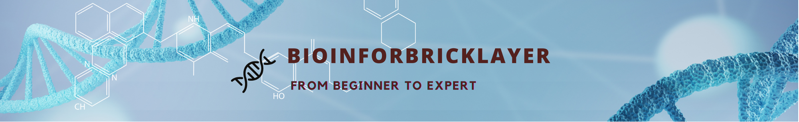

This directory contains all the learning materials, papers, files, slides and codes for the videos at my Youtube channels: [Bioinforbricklayer](https://www.youtube.com/channel/UC9GCtpQdyJW2_Es8psxHGMw?sub_confirmation=1) and [生信进阶之路](https://www.youtube.com/channel/UCrOINtaeDHkSz34DANQej5g?sub_confirmation=1), as well as Bilibili channel [bioinforbricker](https://space.bilibili.com/1605459521?spm_id_from=333.788.0.0). See brief introduciton of the content and the aim of the channel [here](https://www.youtube.com/watch?v=7ON50rHM82U&t=2s). The channel covers the following topics and subtopics, aimed at taking you from beginner to expert in bioinformatics field. 

## 1. Bioinformatics Tutorials

This section includes tutorials on the following subtopics:

### a. Bioinformatics Skills

Share all the skills and experiences I gained in my 10+ years career in bioinformatics field, helping you quickly get ready for hands-on tasks in bioinformatic analysis and research. If you find the videos useful,please consifer subscribing my [English](https://www.youtube.com/channel/UC9GCtpQdyJW2_Es8psxHGMw?sub_confirmation=1) and/or [Chinese](https://www.youtube.com/channel/UCrOINtaeDHkSz34DANQej5g?sub_confirmation=1) channels for more updates to come...

- [Skills_01: How to work on Linux system with zero knowledge](https://www.youtube.com/watch?v=ACPOOBUpUB8&t=45s)
- [技能篇01:如何零基础玩转Linux操作系统](https://www.youtube.com/watch?v=iWjDQ0cIgkU&t=24s)
- [Skills_02: How to convert among different gene IDs](https://www.youtube.com/watch?v=Oy4Tu6Nn4vk&t=68s)
- [技能篇02:如何快速批量转换不同基因编号](https://www.youtube.com/watch?v=DDaNRC0rZ98)
- [Skills_03: How to publish and manage your github repository](https://www.youtube.com/watch?v=Yn7vuxJu4do)
- [技能篇03:如何发表和管理你的GitHub项目库](https://www.youtube.com/watch?v=sEFmdjXnpDU)
- [Skills_04: How to plot beautiful protein/DNA sequence logos](https://studio.youtube.com/video/wzxd4VEvtGM/edit)
- [技能篇04:如何画出漂亮的蛋白质/DNA序列特征图](https://studio.youtube.com/video/VlFDxOWGkQU/edit)
- [Skills_05: How to play with protein 3D structure in Jupyter notebook](https://studio.youtube.com/video/wzxd4VEvtGM/edit)
- [技能篇05: 如何在 jupyter notebook 中实现蛋白质三维结构的可视化](https://studio.youtube.com/video/bppN7_Vtbr8/edit)
- [Skills_06: How to perform gene set enrichment analysis with python](https://studio.youtube.com/video/CxguC-duCZM/edit)
- [技能篇06: 如何用 python 进行基因集富集分析](https://studio.youtube.com/video/bppN7_Vtbr8/edit)
- [Skills_07: How to plot volcano plot and perform gene ontology analysis with python](https://youtu.be/VREmf3MZ36A)
- [技能篇07: 如何用 python 画火山图和进行基因本体论分析](https://www.youtube.com/watch?v=DJ7AfdaZ_bU)

### b. Bioinformatics Tools

Explore popular bioinformatics tools widely used for experimental design and data analysis for CRISPR screens, RNAseq, ChIPseq, Perturbseq, etc. If you are also interested, please consider subscribing my [English](https://www.youtube.com/channel/UC9GCtpQdyJW2_Es8psxHGMw?sub_confirmation=1) and/or [Chinese](https://www.youtube.com/channel/UCrOINtaeDHkSz34DANQej5g?sub_confirmation=1) channels for more updates to come...

- [Tools_01: How to design best sgRNA for protein knockout](https://www.youtube.com/watch?v=i9LJ2pMBLio)
- [工具篇01: 如何快速设计用于基因/蛋白敲除的最优sgRNA](https://www.youtube.com/watch?v=5tXF8ytBDfI&t=4s)
- [Tools_02: How to use ChatGPT for our study and research](https://studio.youtube.com/video/TIThBwv4-wA/edit)
- [工具篇02: 如何使用 ChatGPT 来助力生信分析和科学研究](https://studio.youtube.com/video/_XxXd0X0ulo/edit)
- [Tools_03: How to analyze CRISPR high-throughput screen data (part1)](https://studio.youtube.com/video/TIThBwv4-wA/edit)
- [工具篇03: 如何分析 CRISPR 高通量筛选数据（上）](https://studio.youtube.com/video/DGiGa0-5t_s/edit) 
- [Tools_04: How to analyze CRISPR high-throughput screen data (part2)](https://studio.youtube.com/video/Oqk6lcX3Dcc/edit)
- [工具篇04: 如何分析 CRISPR 高通量筛选数据（下）](https://studio.youtube.com/video/pFnl0_4E5Ro/edit)
- [Tools_05: How to analyze tiling-sgRNA CRISPR screen data](https://studio.youtube.com/video/LK_QwWJw5-U/edit)
- [工具篇05: 如何分析基于平铺式 sgRNA 设计的CRISPR 高通量筛选数据](https://studio.youtube.com/video/ifluahhDXDw/edit)

### c. Bioinformatics Resources

Discover online resources for bioinformatics research, including databases, web servers, and educational materials. Please consider subscribing my [English](https://www.youtube.com/channel/UC9GCtpQdyJW2_Es8psxHGMw?sub_confirmation=1) and/or [Chinese](https://www.youtube.com/channel/UCrOINtaeDHkSz34DANQej5g?sub_confirmation=1) channels for more updates to come...

## 2. Papers of the Week

This section will feature slides summarizing important scientific papers in the field of bioinformatics on a biweekly basis. If you are interested, please consider subscribing my [English](https://www.youtube.com/channel/UC9GCtpQdyJW2_Es8psxHGMw?sub_confirmation=1) and/or [Chinese](https://www.youtube.com/channel/UCrOINtaeDHkSz34DANQej5g?sub_confirmation=1) channels for more updates to come...

- [EP01: Amazing tool for scientific paper reading](https://www.youtube.com/watch?v=8BUPjkTgFd4&t=228s)
- [第一集：文献阅读神器助力你的科研](https://www.youtube.com/watch?v=i8l8Np3qsJ4&t=7s)
- [EP02: ProGen: An AI-driven model for large-scale protein design](https://studio.youtube.com/video/1GGQcYzRqyA/edit)
- [第二集：人工智能 ProGen 助力特定功能蛋白质设计](https://www.youtube.com/watch?v=TldrFfNbgjQ)

## 3. Scientific Research

Learn about my experiences in scientific research, including manuscripts writings,project management and other skills.Please subscribe both my [English](https://www.youtube.com/channel/UC9GCtpQdyJW2_Es8psxHGMw?sub_confirmation=1) and [Chinese](https://www.youtube.com/channel/UCrOINtaeDHkSz34DANQej5g?sub_confirmation=1) channels for more updates to come...

### Again! Welcome to start your bioinformatics journey with me. Eager to learn and happy to share on the way to success.

